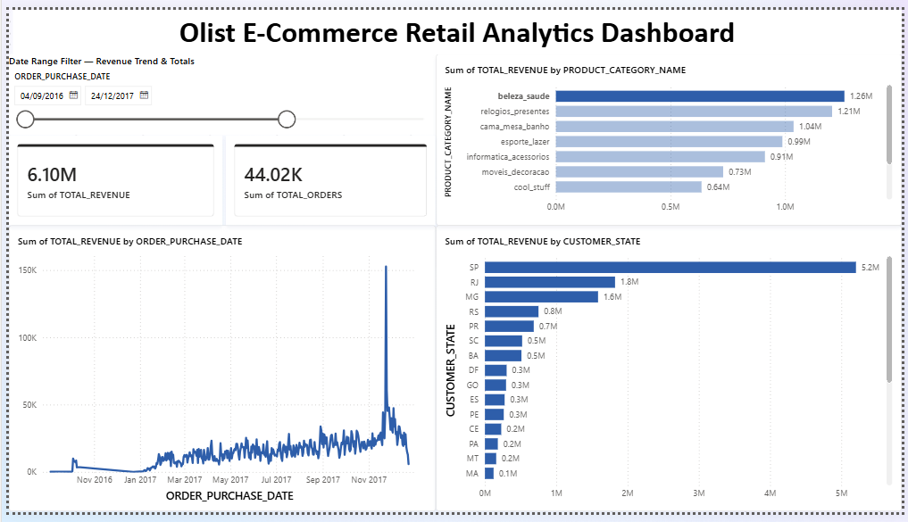

# Olist Retail Lakehouse Pipeline

End-to-end batch ETL pipeline using PySpark, Databricks, Snowflake & Power BI — Medallion architecture on Olist e-commerce data.

## Overview

This project simulates a real-world data engineering workflow: ingesting raw e-commerce data, transforming it with PySpark on Databricks, modeling it into a cloud data warehouse (Snowflake), and visualizing business KPIs in Power BI. It follows the **Medallion Architecture** (Bronze → Silver → Gold), a widely used industry pattern for building reliable, scalable data pipelines.

## Architecture

```
Raw CSVs (Olist Dataset)
        ↓
Bronze Layer (Databricks Delta) — raw ingestion, schema enforced
        ↓
Silver Layer (Databricks Delta) — cleaned, deduplicated, standardized
        ↓
Gold Layer (Databricks Delta) — business aggregates (revenue, orders, categories)
        ↓
Snowflake (Data Warehouse) — serving layer for fast BI queries
        ↓
Power BI — interactive dashboard
```

## Tech Stack

- **Databricks** — cloud compute platform for running Spark workloads
- **PySpark** — distributed data processing and transformation
- **Delta Lake** — ACID-compliant storage format for Bronze/Silver/Gold layers
- **Snowflake** — cloud data warehouse, serving layer for BI tools
- **Power BI** — dashboarding and visualization

## Dataset

This project uses the [Brazilian E-Commerce Public Dataset by Olist](https://www.kaggle.com/datasets/olistbr/brazilian-ecommerce) from Kaggle. It contains ~100k orders placed between 2016–2018, including order status, pricing, payment, customer, product, and review data.

**To reproduce this project:**
1. Download the dataset from the link above
2. Upload the CSVs to your own Databricks Volume (or cloud storage of choice)
3. Update the file paths in `01_bronze_ingestion.ipynb` to match your storage location

## Pipeline Stages

### 1. Bronze — Raw Ingestion (`01_bronze_ingestion.ipynb`)
Reads all 9 raw CSV files and writes them as Delta tables, preserving the original data as-is. This creates a reliable, query-optimized copy of the raw data that the rest of the pipeline builds on.

### 2. Silver — Cleaning & Standardization (`02_silver_transformation.ipynb`)
Cleans the core tables (`orders`, `order_items`, `customers`, `products`, `order_payments`):
- Removes duplicate records
- Standardizes text fields (trimmed, lowercased)
- Filters out invalid rows (nulls, negative prices)
- Extracts clean date columns from timestamps

### 3. Gold — Business Aggregates (`03_Gold_final.ipynb`)
Builds three business-ready tables:
- **`daily_revenue`** — total revenue and order count per day
- **`revenue_by_state`** — total revenue and orders by customer state
- **`top_categories`** — total revenue and items sold by product category

### 4. Load to Snowflake (`04_load_to_snowflake.ipynb`)
Pushes the three Gold tables from Databricks into Snowflake using the Snowflake Spark connector, making them available for fast, concurrent BI queries.

## Data Warehouse Schema (Snowflake)

Setup SQL is in `ddl_setup.sql`. Creates a dedicated warehouse, database, and schema (`RETAIL_DB.GOLD`) with three tables matching the Gold layer output.

## Dashboard

Built in Power BI, connected directly to Snowflake:

- **KPI Cards** — Total Revenue, Total Orders (filterable by date range)
- **Revenue Trend** — daily revenue line chart with a date range slicer
- **Revenue by State** — bar chart showing top-performing states
- **Top Product Categories** — bar chart showing highest-revenue categories

See `dashboard.png` above for a preview, or open `Sales Dashboard.pbix` in Power BI Desktop (Snowflake credentials required to refresh live data; cached visuals will still display without them).

## Key Design Decisions

- **Why Delta Lake for Bronze/Silver/Gold?** Delta adds ACID transactions, schema enforcement, and versioning on top of raw Parquet — far more reliable than working directly with CSVs at each stage.
- **Why Snowflake instead of querying Databricks directly?** Databricks/Spark is optimized for heavy, large-scale batch transformation — not fast, small, repeated interactive queries. Snowflake is purpose-built to serve exactly that kind of workload to BI tools, at lower cost and latency for dashboard use cases.
- **Why pre-aggregate in Gold rather than aggregate in Power BI?** Keeps the BI layer lightweight and fast, and ensures business logic (revenue calculations, filters) lives in one governed place (the pipeline) rather than being reimplemented ad hoc in the dashboard.

## Challenges & Learnings

Working through this project surfaced a few real-world data engineering hurdles: Snowflake's Spark connector requires different write options for serverless vs. classic compute clusters, and pre-aggregated Gold tables need to retain a shared key (like date) if you want cross-filtering across multiple tables in a BI tool. Debugging schema mismatches and connector errors was a useful reminder that architecture decisions early in the pipeline shape what's possible downstream.

## Future Improvements

- **Orchestration** — introduce Apache Airflow to schedule and monitor the pipeline end-to-end instead of running notebooks manually
- **Streaming ingestion** — add Apache Kafka to simulate real-time order ingestion alongside the existing batch flow
- **Incremental loads** — move from full `overwrite` writes to incremental/merge-based updates for Silver and Gold layers
- **Data quality tests** — add automated validation (e.g., row count checks, null checks) between each layer

## Repository Structure

```
olist-retail-lakehouse-pipeline/
├── 01_bronze_ingestion.ipynb
├── 02_silver_transformation.ipynb
├── 03_Gold_final.ipynb
├── 04_load_to_snowflake.ipynb
├── ddl_setup.sql
├── dashboard.png
├── Sales Dashboard.pbix
└── README.md
```
